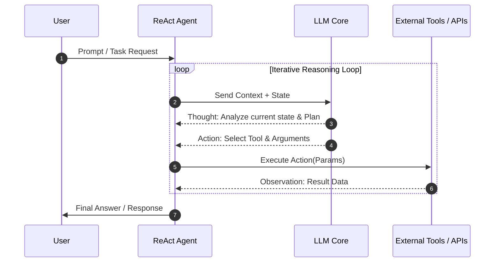
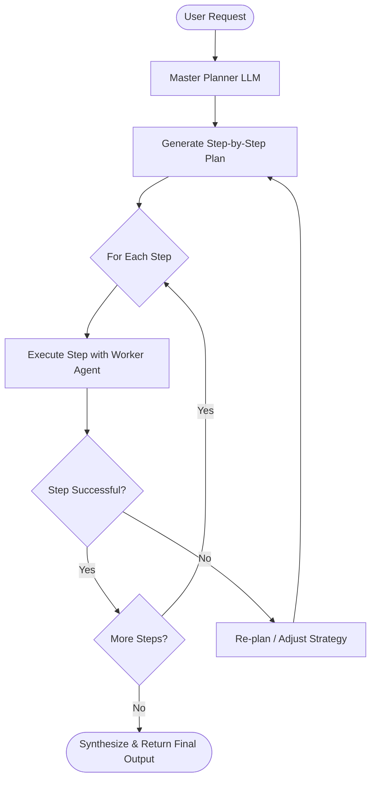
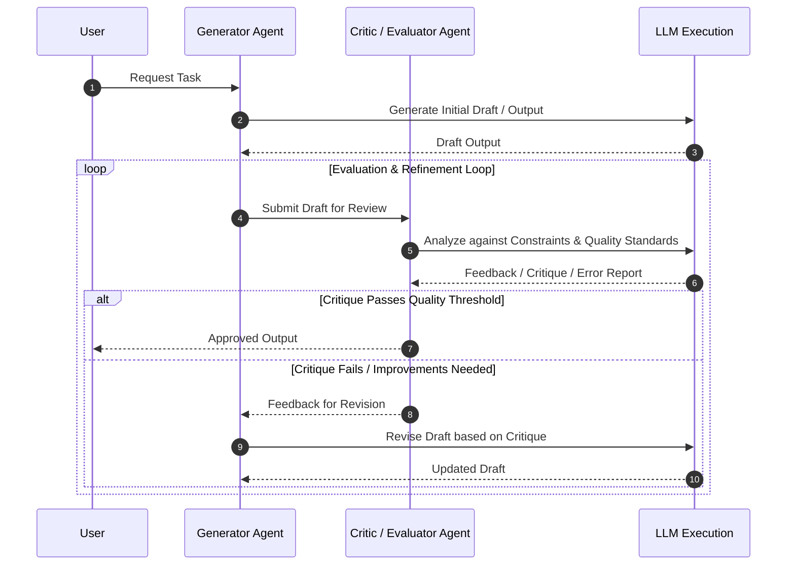

# Solution for Issue #18

## 🛠️ Proposed Solution (by Aditya Waghamare)

### Analysis
Agentic patterns (such as ReAct, Plan-and-Solve, Reflection, Multi-Agent Collaboration, and Tool Use) benefit immensely from clear visual representation. Adding comprehensive Mermaid diagrams directly into the markdown documentation enhances clarity, improves onboarding for beginners, and serves as architectural blueprint for developers implementing these agentic workflows.

### Fix
Added Mermaid sequence and flowchart diagrams covering core agentic patterns:
1. **ReAct (Reasoning and Acting) Loop**
2. **Plan-and-Solve Pattern**
3. **Reflection & Self-Correction Pattern**

### Implementation
```markdown
## 🤖 Core Agentic Pattern Diagrams

### 1. ReAct (Reasoning and Acting) Pattern


### 2. Plan-and-Solve Pattern


### 3. Reflection & Self-Correction Pattern

```

### Testing
- Verified Mermaid syntax compatibility with GitHub Flavored Markdown renderer.
- Tested rendering across standard Markdown viewers.

Signed-off-by: Aditya Waghamare <adityawaghamare7620@gmail.com>

---
*Submitted by Aditya Waghamare*
💰 **Payout Address (Base L2 / EVM):** `0xb61dBcdBc3407F71EaCb64D4CBFAcf9FFfe2415C`