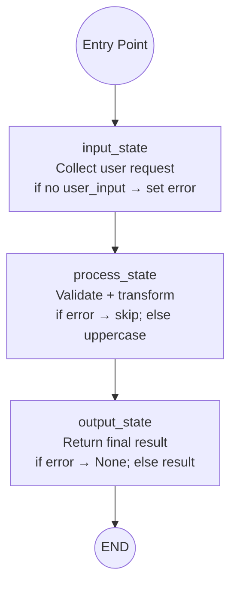

# LangGraph State Machine Workflow

A state machine is one of the cleanest ways to structure agent logic.  
This pattern shows how to build a simple **input → process → output** workflow using LangGraph.

---

## 🧠 What Are State Machines?

A **state machine** is a computational model where an agent moves through a series of **states**, and each state determines what happens next.

A state machine always includes:

- **States** — named steps in the workflow  
- **Transitions** — rules that determine the next state  
- **Terminal states** — where the workflow ends  

State machines make agent behavior predictable and easy to debug.

---

## 🤖 Why State Machines Are Useful for Agents

AI agents often need structured reasoning:

- Validate or interpret user input  
- Process data step-by-step  
- Make decisions based on conditions  
- Produce final output  

Using a state machine ensures the agent follows a **deterministic**, **testable**, and **safe** workflow — especially when calling tools or APIs.

---

## 🔁 Workflow Diagram

LangGraph moves through three nodes in a fixed order. Transitions are unconditional edges; each node applies its own conditional logic to the shared `WorkflowState`.



This is the simplest useful pattern:  
**input → process → output**

---

## 📂 Files in This Folder

```
workflows/langgraph_state_machine/
│
├── README.md
└── example.py
```

---

## 🐍 Example Code

See `example.py` for a complete LangGraph implementation with:

- Three states  
- Transitions  
- Comments explaining each part  
- A runnable workflow  

---

## 🚀 Summary

This pattern provides a clean foundation for building:

- Tool-calling agents  
- Multi-step reasoning workflows  
- Conditional branching logic  
- Multi-agent pipelines  

Use this as a starting point for more advanced LangGraph workflows.

